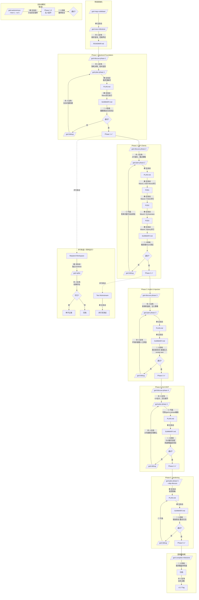

# GSD 人工参与度流程图

## 图例
- 🟢 **全自动** — 无需人工，后台自运行
- 🟡 **人在场** — 需要实时参与决策
- 🔵 **人验收** — 完成后需要人工检查确认
- ⚪ **可选** — 可自动也可人工，取决于配置

---

## 完整流程图（Mermaid）



---

## 简化版：人工参与度速查表

| 阶段 | 命令 | 参与度 | 说明 |
|------|------|--------|------|
| **代码地图** | `/gsd-map-codebase` | 🟢 全自动 | 分析代码库，无需在场 |
| **里程碑启动** | `/gsd-new-milestone` | 🟡 人在场 | 需求澄清、范围界定 |
| **Phase 讨论** | `/gsd-discuss-phase` | 🟡 人在场 | 架构/UX决策、灰区确认 |
| **Phase 规划** | `/gsd-plan-phase` | 🟢/⚪ 自动/可选 | 需求清晰时全自动 |
| **Phase 执行** | `/gsd-execute-phase` | 🟢 全自动 | Wave内任务并行自运行 |
| **代码审查** | `/gsd-code-review` | ⚪ 可选 | 可自动跑，但建议人工看 |
| **Phase 验收** | `/gsd-verify-work` | 🔵 人验收 | 必须人工确认功能正确 |
| **Debug** | `/gsd-debug` | 🟡/⚪ 视复杂度 | 简单问题可自动，复杂需人 |
| **里程碑完成** | `/gsd-complete-milestone` | 🔵 人验收 | 需求覆盖率最终确认 |
| **全自动流水线** | `/gsd-autonomous` | 🟢+🟡 混合 | 自动运行，灰区时暂停等人 |

---

## 推荐的"人在场"节奏

```
Day 1  上午: /gsd-new-milestone          ← 人在场（2小时）
Day 1  下午: /gsd-autonomous --only 1     ← 离开，全自动

Day 2  上午: /gsd-verify-work 1           ← 人在场验收（30分钟）
Day 2  上午: /gsd-discuss-phase 2         ← 人在场决策（1小时）
Day 2  下午: /gsd-manager                  ← 人在场调度
            ├─ 前台: Phase 3 discuss
            └─ 后台: Phase 2 execute

Day 3-5:    全自动执行 Phase 2-3          ← 离开

Day 6:      /gsd-verify-work 2-3          ← 人在场验收
            /gsd-discuss-phase 4          ← 人在场 UX 设计

Day 7-10:   全自动 Phase 4-5              ← 离开

Day 11:     /gsd-verify-work 4-5          ← 人在场验收
            /gsd-complete-milestone       ← 人在场发布决策
```

**实际人在场时间**：约 8-10 小时（分布在 11 天中）
**全自动运行时间**：约 70-80% 的项目周期
