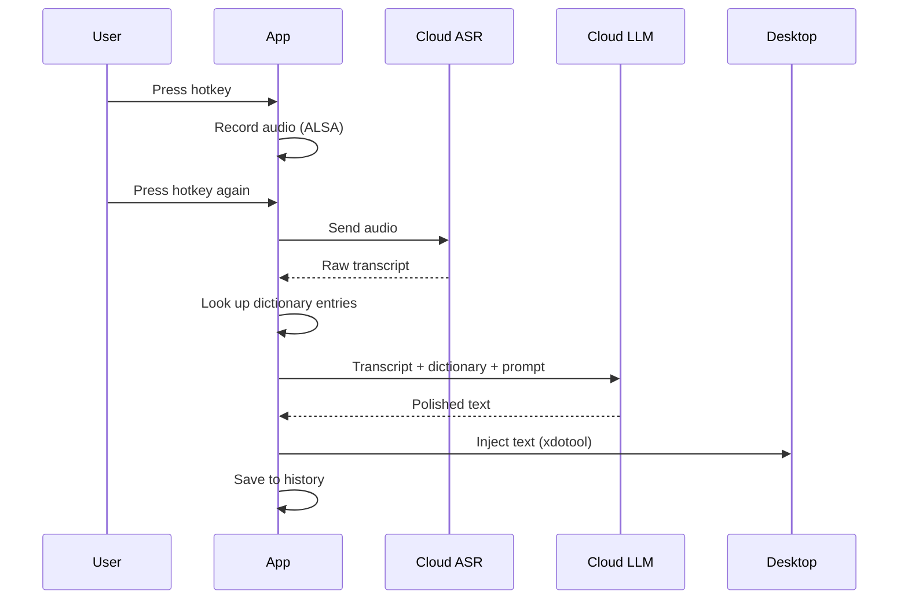

# ASR Linux

**AI-powered voice dictation for the Linux desktop.**

Press a hotkey, speak — and your words, polished by LLM, appear in the focused window. Built for developers, writers, and anyone who wants to type by talking.

## Features

- **🎙️ Voice-to-text pipeline** — Record → Cloud ASR → LLM polish → Text injection
- **🤖 LLM-powered polish** — Automatically removes fillers ("嗯", "那个"), adds punctuation, fixes misrecognitions — via any OpenAI-compatible API
- **📖 Smart dictionary** — Custom terms with pinyin fuzzy matching (多音字/音近容忍), enforcement levels (suggested/forced)
- **⌨️ Global hotkey** — Configurable shortcut (default `Alt+=`), toggle recording
- **🪟 Overlay window** — See recording status, pipeline phase, and mic level without leaving your work
- **🔄 Retry failed sessions** — One-click re-polish and re-inject from history
- **🔒 Privacy-first** — Backend binds `127.0.0.1` only; secrets stored in Linux Secret Service; logs auto-redact API keys
- **🌐 Bilingual** — Chinese (zh) and English (en) UI

## Architecture

```
┌────────────────────────────────────────────────────┐
│                   Electron (GUI)                    │
│  ┌──────────┐  ┌───────────┐  ┌──────────────────┐ │
│  │ Settings │  │  History  │  │ Overlay (always  │ │
│  │  Window  │  │   Page    │  │  on top / bottom)│ │
│  └────┬─────┘  └─────┬─────┘  └────────┬─────────┘ │
│       │               │                 │           │
│  ┌────┴───────────────┴─────────────────┴────────┐  │
│  │         Preload (contextBridge IPC)           │  │
│  └────────────────────┬──────────────────────────┘  │
│                       │                              │
│  ┌────────────────────┴──────────────────────────┐  │
│  │            Main Process (Node.js)              │  │
│  │  • Backend supervisor (spawn/manage Python)   │  │
│  │  • Global hotkey registration                 │  │
│  │  • Window lifecycle & tray                    │  │
│  └────────────────────┬──────────────────────────┘  │
└───────────────────────┼──────────────────────────────┘
                        │ HTTP (localhost) + WebSocket
┌───────────────────────┴──────────────────────────────┐
│              Python Backend (FastAPI)                 │
│  ┌──────────┐ ┌────────┐ ┌───────┐ ┌──────────────┐ │
│  │ Recorder │ │  ASR   │ │Polish │ │    Text      │ │
│  │ (ALSA)   │ │ Client │ │Client │ │  Injector    │ │
│  └────┬─────┘ └───┬────┘ └───┬───┘ └──────┬───────┘ │
│       │            │          │             │         │
│  ┌────┴────────────┴──────────┴─────────────┴──────┐  │
│  │          Dictation Orchestrator                  │  │
│  │  (state machine: record → transcribe → polish   │  │
│  │                  → inject → history)            │  │
│  └────────────────────┬──────────────────────────────┘  │
│                       │                                  │
│  ┌────────────────────┴──────────────────────────────┐  │
│  │  SQLite (history, prompts, dictionary, config)    │  │
│  │  + Linux Secret Service (API keys)               │  │
│  └────────────────────────────────────────────────────┘  │
└──────────────────────────────────────────────────────────┘
```

## Quick Start

### Prerequisites

- **Linux** with ALSA (`arecord` from `alsa-utils`) and X11
- **Python 3.11+** with [uv](https://docs.astral.sh/uv/)
- **Node.js 20+** with npm
- **System tools:** `xdotool` + `xsel` or `xclip`

```bash
# Install system dependencies (Debian/Ubuntu)
sudo apt install alsa-utils xdotool xsel xclip xprop
```

### Setup

```bash
# Backend
uv sync                          # Install Python dependencies
uv run pytest                    # Run backend tests

# Frontend
npm install                      # Install Node dependencies
npm test                         # Run frontend tests

# Build & run
npm run dev                      # Build and launch the app
```

### Configuration

Configure API keys via the **Settings UI** after launching, or via environment variables:

```bash
cp .env.example .env
# Edit .env with your API keys
```

| Variable | Description |
|----------|-------------|
| `ASR_LINUX_MIMO_API_KEY` | ASR service key (MiMo) |
| `ASR_LINUX_LLM_API_KEY` | LLM service key (OpenAI-compatible) |
| `ASR_LINUX_SECRET_TOKEN` | API auth token (optional, for localhost API) |
| `ASR_LINUX_LOG_LEVEL` | `info` / `debug` / `trace` |

## Pipeline



## Development Phases

| Phase | Status | Description |
|-------|--------|-------------|
| 0 | ✅ Done | Project skeleton, docs, test setup |
| 1 | ✅ Done | Bug fix sprint (overlay, dictionary) |
| 2 | ✅ Done | Frontend refactor (SettingsPage split) |
| 3 | ✅ Done | Polish & hardening (security, error handling, prompt CRUD) |
| 4 | ✅ Done | Electron GUI MVP (settings, history, overlay, hotkey) |
| 5 | ✅ Done | Product hardening (error messages, retry, diagnostics) |
| 6 | ✅ Done | Core config & UX (ASR language, VAD controls, level optimization) |
| 7 | ✅ Done | History & overlay (copy/export, dict stats, progress bar) |
| 8 | ✅ Done | Overlay polish + onboarding (continuous progress bar, 4-step wizard) |
| 9 | ✅ Done | Scene profiles (5 presets, CRUD, tray switch) |
| 10 | ✅ Done | History redesign (preview, diff view, search API) |
| 11 | ✅ Done | Dashboard + stats (latency charts, stats API) |
| 12 | ✅ Done | Clipboard save/restore (save/restore/fallback) |
| 13 | ✅ Done | Streaming ASR (ring buffer, transcript merge, partial preview) |
| 14 | ✅ Done | Connection warmup (fire-and-forget probe on recording start) |
| 15 | ✅ Done | Theme system (warm light + dark themes, CSS variables, persistence) |
| 16 | 🚧 Layout | Top tab bar + dual-pane layout (sidebar removal) |
| 17 | 📋 Planned | Floating orb overlay (4-state animation) |
| 18 | 📋 Planned | Animation & polished components |
| 19 | 📋 Planned | Dashboard polish & animated counters |

> **v0.2.0** — Major Dashboard rework: time range selector (today/7d/30d), server-side stats, Y-axis labels, timezone-corrected timeline, auto-refresh on tab switch, fixed `timing_ms` storage bug.

## Tech Stack

| Layer | Technology |
|-------|-----------|
| Desktop shell | Electron 30 + TypeScript 5.4 |
| UI | React 18 + Tailwind CSS 3.4 + Framer Motion |
| Backend | Python 3.11+ / FastAPI / Uvicorn |
| Persistence | SQLite |
| Communication | HTTP (actions) + WebSocket (status/levels) |
| Build | Vite (renderer), npm (frontend), uv (Python) |

## License

MIT
